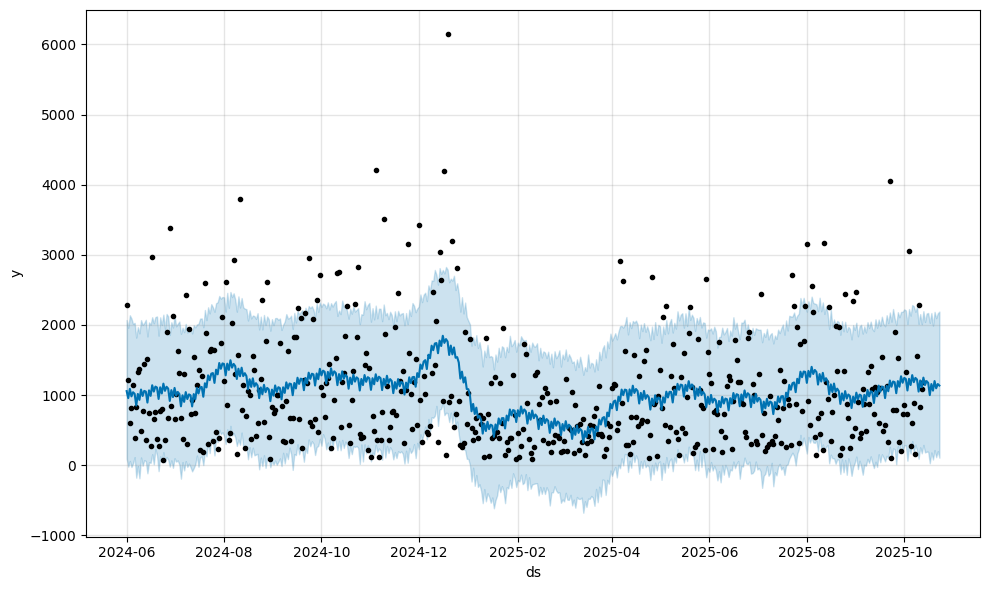
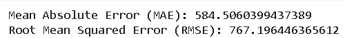
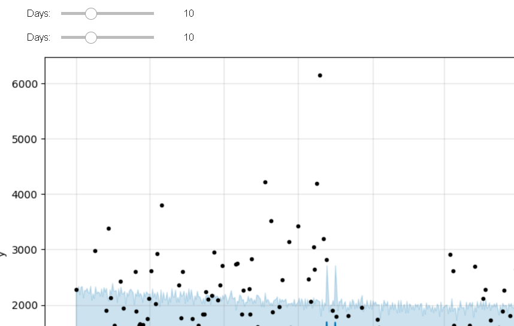

# 🚀 Hotel Stay Cost Forecasting with Meta’s Prophet

Forecasting hotel stay costs isn’t just about predicting prices — it’s about unlocking business agility. This project leverages **Meta’s open-source Prophet** model to forecast daily hotel pricing with precision, capturing **seasonal trends, holiday spikes**, and even enabling **real-time user interaction** for tailored predictions.

---

## 🔍 Overview

This project solves a real-world problem in the **hospitality industry** by predicting hotel stay costs up to 30 days into the future. Built on real data and implemented in Google Colab, it demonstrates the full power of Prophet when paired with clean data, dynamic controls, and thoughtful evaluation.

---

## ✨ Highlights

- ✅ **Prophet model** with yearly seasonality, holiday effects & regressors
- 📅 Incorporates **special events** like holidays using custom windows
- 🔄 **Interactive slider UI** to generate on-demand forecasts (1–30 days)
- 📊 Visualizes confidence intervals with `yhat_lower`, `yhat_upper`
- 🧪 **Evaluated using** MAE, RMSE, and R² (Score: 0.84)
- 💾 Model serialized as `.pkl` for deployment-readiness

---

## 📈 Visual Snapshots

| Forecast Chart | Evaluation Metrics | Interactive Forecast UI |
|----------------|--------------------|--------------------------|
|  |  |  |

---

## ⚙️ Tech Used

- **Prophet (Meta)** – Time series forecasting engine  
- **Pandas** – Data wrangling  
- **Matplotlib** – Visualizations  
- **Ipywidgets** – Real-time interactivity  
- **Scikit-learn** – Model evaluation metrics  

---

## 🧪 Results

| Metric | Value |
|--------|-------|
| MAE    | 584.51 |
| RMSE   | 767.19 |
| R²     | 0.84   |

---

## 📂 Key Files

---

## 💡 Why This Project Matters

This repo showcases **how Prophet can be extended beyond static forecasts**:
- It blends **real-time interactivity** with **real-world complexity**
- It shows how **Meta’s tools** can empower data scientists in verticals like hospitality, retail, and travel
- And most importantly — it's clear, reproducible, and instantly useful for production or research

---

## 👨‍💻 Author

**Akhil Chatla**  
M.S. in Data Science & Analytics, Florida Atlantic University  
[🔗 LinkedIn](https://www.linkedin.com/in/akhil-chatla-07847b1a7) 